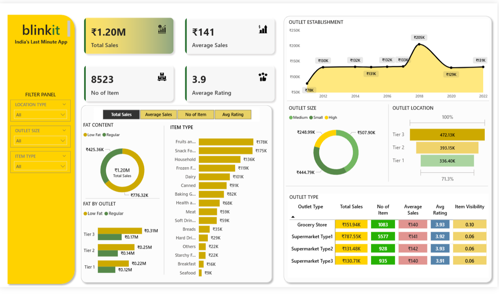

# Sales Performance Dashboard Analysis

    

This report provides a detailed analysis of the company's performance, leveraging data from key business sources. The dashboard is designed to offer a complete view of the business, facilitating both granular operational insights and high-level strategic evaluation.

## Data Sources

The analysis is built upon the following core datasets:

### "[Primary Data Table, e.g., Orders]"

This dataset forms the foundation for understanding the company's day-to-day operations. It contains a transactional view of business activities.

* **Geographic Insights**: Data is broken down by `[e.g., City, State, and Region]`, which is crucial for evaluating local market performance. This allows for an analysis of `[e.g., sales in specific locations and how they contribute to regional performance]`.
* **Customer and Product Segmentation**: Data is categorized by `[e.g., Customer Segment like Consumer, Corporate]` and product details like `[e.g., Category and Sub-Category]`. This segmentation is essential for `[e.g., targeted marketing, inventory management, and product development]`.
* **Temporal Trends**: The inclusion of `[e.g., Order Date, Year, and Month]` enables time-series analysis to identify `[e.g., seasonal trends and peak business periods]`. This is valuable for `[e.g., forecasting, campaign planning, and resource allocation]`.

### "[Secondary Data Table, e.g., Sales Plan or Targets]"

This dataset offers a strategic perspective and is the primary tool for evaluating performance against established goals.

* **Performance vs. Plan**: This source allows for a direct comparison of `[e.g., Actual Sales]` with `[e.g., Planned Sales]` on a `[e.g., yearly and regional]` basis. This comparison is critical for assessing the effectiveness of strategic initiatives.
* **Strategic Evaluation**: A significant variance between actuals and targets may indicate a need for deeper investigation. For instance, `[e.g., a region that consistently underperforms against its plan may require a revised strategy or additional resources]`.
* **Accountability and Goal Setting**: This dataset is fundamental for management to assess performance, establish accountability, and set realistic future goals.

## Dashboard Features

The dashboard visualizes the data through several key sections:

### Overall Performance Metrics (KPIs)

* **[KPI 1, e.g., Plan Achievement Rate]**: Shows `[e.g., the overall percentage of sales achieved against the sales plan]`.
* **[KPI 2, e.g., Total Revenue]**: Displays `[e.g., total sales revenue, broken down by region and year]`.
* **[KPI 3, e.g., Quantity Sold]**: Details `[e.g., the total quantity of items sold, categorized by region and year]`.
* **[KPI 4, e.g., Number of Cities]**: Shows `[e.g., the total number of unique cities where sales occurred]`.

### Analysis by [Dimension 1, e.g., Category and Segment]

* **[Chart 1 Title, e.g., Sales by Category]**: A `[e.g., column chart]` shows `[e.g., yearly sales for the main product categories]`, while a `[e.g., doughnut chart]` displays `[e.g., the percentage contribution of each category]`.
* **[Chart 2 Title, e.g., Sales by Segment]**: A `[e.g., column chart]` displays `[e.g., yearly sales for different customer segments]`, complemented by a `[e.g., doughnut chart]` showing the percentage breakdown.
* **[Chart 3 Title, e.g., Sales by Subcategory]**: A `[e.g., pie chart]` highlights the `[e.g., top 8 highest-selling subcategories]`.

### [Dimension 2, e.g., Geographic and Regional Performance]

* **[Chart 4 Title, e.g., Revenue by Region]**: This chart presents `[e.g., a yearly breakdown of sales across all product categories, organized by region]`.
* **[Feature 1, e.g., Top Performers]**: This feature highlights the `[e.g., top 10 cities with the highest sales]`, showing their `[e.g., total yearly sales by region]`. This can be viewed as a `[e.g., bar chart]`.
* **[Feature 2, e.g., Bottom Performers]**: This identifies the `[e.g., 10 cities with the lowest sales]`, also displayed as a `[e.g., bar chart showing total yearly sales by region]`.
* **[Interactive Element, e.g., Result Buttons]**: Describe any interactive elements, for example, `[e.g., A "Best Result" button to show the top performers and a "Worst Result" button for the bottom performers]`.

### [Dimension 3, e.g., Time-Based Performance]

* **[Chart 5 Title, e.g., Revenue by Month]**: A `[e.g., bar chart]` illustrates `[e.g., monthly sales across all years included in the dataset]`.
* **[Chart 6 Title, e.g., Revenues by Quarter]**: An `[e.g., area chart]` displays `[e.g., sales performance on a quarterly basis for all years]`.

## Conclusion

This performance dashboard provides a comprehensive and multi-faceted view of the company's operations, successfully merging granular transactional data with high-level strategic goals. By visualizing performance across various dimensions—`[e.g., geography, product category, customer segment, and time]`—the dashboard transforms raw data into actionable intelligence.

Key insights reveal not only which `[e.g., regions and product lines]` are driving revenue but also where performance lags behind established targets. The identification of top and bottom-performing `[e.g., cities or products]` offers a clear starting point for strategic intervention, allowing management to replicate success and address areas of concern. Ultimately, this analytical tool empowers the organization to move beyond simple tracking. It facilitates a deeper understanding of market dynamics, enhances accountability, and supports data-driven decision-making to optimize strategies, refine efforts, and achieve sustained growth.
